<a href="https://github.com/nguyenrot">
  
</a>

<p align="center">
  <a href="https://git.io/typing-svg">
    
  </a>
</p>

<p align="center">
  
</p>

<p align="center">
  
  
  
</p>

<br/>

<table width="100%">
<tr>
<td valign="top" width="62%">

### About

I'm Nguyên — I write Django and Python for work. Most of what I ship sits at the
spot where backend correctness meets actual user-facing software: APIs that
don't silently lie, migrations that don't surprise anyone on Friday, and pages
that arrive before the spinner does.

Based in Đà Nẵng, Việt Nam. Right now I'm pushing on test coverage, trimming
database round-trips, and getting sharper at the frontend half of the stack.

</td>
<td valign="top" width="38%">

<br/>

<sub><b>STACK</b></sub><br/>
<sub>Python · Django · PostgreSQL</sub><br/>
<sub>JavaScript · TypeScript · React</sub><br/>
<sub>Tailwind · Docker · Linux</sub>

<br/>
<br/>

<sub><b>NOW</b></sub><br/>
<sub>Backend depth, frontend craft.</sub>

<br/>
<br/>

<sub><b>REACH</b></sub><br/>
<sub><a href="mailto:phamkynguyen753@gmail.com">phamkynguyen753@gmail.com</a></sub>

</td>
</tr>
</table>

<br/>

### Snapshot

```python
nguyen = {
    "name": "Nguyên",
    "role": "Software Development Engineer",
    "location": "Đà Nẵng, Việt Nam",
    "stack": ["Python", "Django", "JavaScript"],
    "habits": ["read tracebacks", "name things twice", "ship small"],
}
```

<br/>

---

<p align="center">
  
</p>

---

<p align="center">
  
  
</p>

<p align="center">
  
</p>

<p align="center">
  
</p>

---

<p align="center">
  <a href="mailto:phamkynguyen753@gmail.com"></a>
  <a href="https://www.linkedin.com/in/nguyen-pham-ky"></a>
  <a href="https://www.facebook.com/phkynguyen"></a>
  <a href="https://www.instagram.com/phkynguyen"></a>
  <a href="https://www.tiktok.com/@phamkynguyen"></a>
</p>

<br/>

<p align="center">
  <sub>Code with clarity. Ship with care.</sub>
</p>
