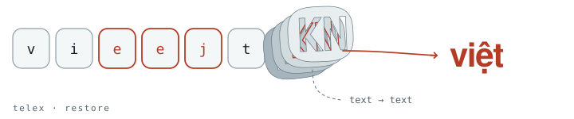

# Nguyên

Software Engineer · Đà Nẵng

I build backend systems, developer tools, and things I want to exist.

  <picture>
    <source media="(prefers-color-scheme: dark)" srcset="./assets/identity-dark.svg">
    
  </picture>

## Selected work

### GõViệt

Vietnamese input for macOS, in the Unikey style: a menu-bar app that types in every program without switching input sources.

<picture>
  <source media="(prefers-color-scheme: dark)" srcset="./assets/goviet-dark.svg">
  
</picture>

A pure Rust engine owns Telex, VNI, tone placement, and syllable validation. Fourteen data-driven TSV corpora cover composition; `valid_prefix` restores English so `text` stays `text`, not `tẽt`.

The Swift shell taps the system with `CGEventTap`. Fast apps get a direct inject; terminals are paced; Chromium gets select-and-retype so the omnibox does not fight backspace bursts. Every synthetic event is stamped `GVIT` so the tap ignores its own output.

Architecture

Rust engine → C ABI with fixed-size buffers (no allocation on the hot path) → Swift <code>EventTapManager</code>, <code>TextInjector</code>, and per-bundle app profiles. A watchdog polls tap health. The signing identity is pinned so Accessibility permission survives rebuilds. UniKey-compatible edge cases — English words that are also valid Vietnamese syllables — are listed in <code>known_limitations.tsv</code> rather than papered over. Not notarized yet; the DMG is signed with an Apple Development cert.

[Repository](https://github.com/nguyenrot/goviet) · [Releases](https://github.com/nguyenrot/goviet/releases)

###  Lattice

Bilingual essays. Nuxt reads; Django and PostgreSQL publish. One content model, two languages — an API boundary in exchange for a reading surface that can move on its own.

[lattice.kynguyen.cc](https://lattice.kynguyen.cc)

###  Lumi

A conversational AI workspace. A per-thread buffer receives server-sent events and renders each part as it arrives; polling takes over when the stream drops. Faster perceived response, in exchange for handling partial messages, reconnects, and unfinished Markdown.

[lumi.kynguyen.cc](https://lumi.kynguyen.cc)

###  Citadel

A hand-drawn tower defense in the browser. The simulation is headless and separate from Canvas, so bots can play stages and check balance before art changes reach the screen.

[citadel.kynguyen.cc](https://citadel.kynguyen.cc)

The rest of the ecosystem lives at [kynguyen.cc](https://kynguyen.cc).

## How I work

Most of what I ship sits where backend correctness meets software people actually use: APIs that don't silently lie, migrations that don't surprise anyone on Friday, boundaries you can point to. I write the dull parts well — the rest gets easier.

## Stack

Python · Django · PostgreSQL  
TypeScript · Vue · Rust

---

## Elsewhere

[kynguyen.cc](https://kynguyen.cc) · [nguyen@kynguyen.cc](mailto:nguyen@kynguyen.cc) · [LinkedIn](https://www.linkedin.com/in/nguyen-pham-ky)
